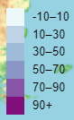

# leaflet-challenge

## About
This challenge aims to develop a way to visualise USGS (United States Geological Survey) earthquake data that will allow them to better educate the public and other government organisations on issues facing our planet. The agency collects a massive amount of data from all over the world each day and this interactive map will provide them a meaningful way of displaying it.

## Data
The map will show the locations of the most recent earthquakes recorded all over the world in the past 7 days using the geojson data from USGS website (https://earthquake.usgs.gov/earthquakes/feed/v1.0/geojson.php) by choosing "All Earthquakes" in the "Past 7 Days" section (https://earthquake.usgs.gov/earthquakes/feed/v1.0/summary/all_week.geojson)

## Tools
*Javascript 
*Leaflet
*D3 Library
*HTML & CSS

## Map

### Layers
Default view will be a topographic map but the streetmap option is also available, should it be the preferred view.

### Legend for the depth
Shows the depth (in km) information of the earthquake based on the colour scale provided

### Markers
The circle markers represent the actual location of each earthquake. When clicked, each marker will show the information of the place where it happened, the magnitude, and the time.
